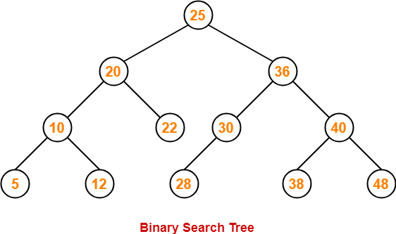
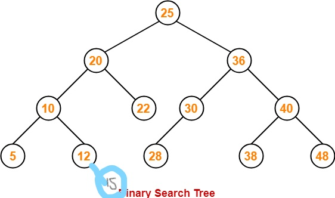
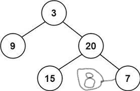
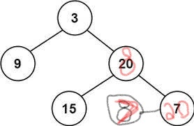

# Trees

## Introduction
Trees are compaired to linked lists where nodes are connected together by pointers. There are a couple differences like how a tree can connect to multiple different nodes.

In this lesson we will be learning about the following types of trees:
* Binary Trees
* Binary Search Trees
* Balanced Binary Search Trees

## Binary Trees


This type of tree that can only link up to two nodes. The different type of nodes are root, leaf, child, and parent nodes. These make up the tree. The leaf nodes are the nodes that dont connect to any other nodes. The root node is the top and spans to other nodes. The nodes that are connected to the parent are called the child nodes, and lastly the parent nodes are connected to other nodes. 

## Binary Search Tree


The binary search tree follows the rules placed in the tree corresponding with the data. This means that if the data being added to the tree is greater or less than the parent node, the data will either be put in the left subtree or right subtree. This process sorts all of the data.

Looking at the example picture above can you input the additional value?
* Insert the value 15
<details>
<summary markdown="span">Solution To Practice Binary Search Tree Example</summary>



We can see that the "15" is less then the "25" at the root so we go to the left. Then it is less than the "20" so we go to the left again. It is greater than the "10" so we go to the right. Then it is greater than the "12" so we go to the right again.
</details>

The efficency can be different depending on the tree. For example if we have a tree with the root of 2 with the same values the tree would be all going to the right and be very unbalanced. With the unbalanced tree the efficency would be O(n) instead of O(log n).

## Balanced Binary Search Trees


In the race to efficency we want to have a balanced tree with as much control of that as possible. Algorithms have been written to see if a tree is unbalanced or not with a goal to correct them. Above is an example of having balanced height and where it can detect the tree becoming unbalanced.

Look at the following tree and make it balanced again.
<details>
<summary markdown="span">Solution To Practice Balanced Binary Search Tree Example</summary>



First we have to look and see the problem. As we can see the unbalanced side of the tree is where the "8" is. The height doesnt match up to the other side. We rotate the nodes and now it is balanced.

</details>

## Efficiency
Operators | Efficency
 --- | ---
Binary | O(1)
Unbalanced Binary Search | O(n)
Balanced Binary Search | O(log(n))
The trees range from different complexity. Overall the Balanced tree is more efficent.

## Problem To Solve: Sets
Now its time to show what you have learned!

I have created a more complex set using some functions corresponding with the set. Finish the code for the functions to print out correctly.
```py
def add_sets(set1, set2):
    # Update or add one set to the other.

def remove_even(set1):
    # Remove even numbers in a set.

def remove_odd(set1):
    # Remove odd numbers in a set.

sul1 = {1, 6, 9, 10}
sul2 = {10, 100, 1000, 1000}
sul3 = {2, 3, 4, 5}

print(add_sets(sul1, sul2)) # {1, 6, 9, 10, 100, 1000, 10000}
print(add_sets(sul1, sul3)) # {1, 2, 3, 4, 5, 6, 9, 10}
print(add_sets(sul2, sul3)) # {1, 10, 20, 25, 30, 35, 40}
print(remove_odd(sul1)) # {6, 10}
print(remove_odd(sul2)) # {10, 100, 1000, 10000}
print(remove_even(su3)) # {3, 5}
print(remove_even(sul1)) # {1, 9}
```
Solution to [Problem To Solve](answers/set-answer.md)

Go to [Welcome Page](0-welcome.md)!